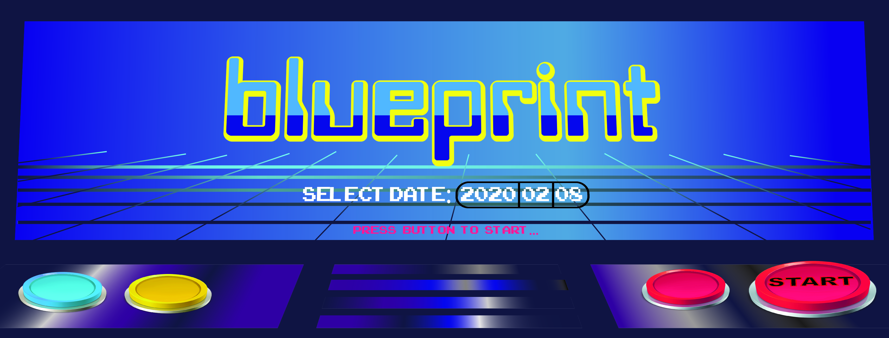

# MIT Blueprint Learnathon 2019 Arduino Track

Arduino track content from [Blueprint 2020](https://blueprint.hackmit.org/).

Follow along with the slides **[here](slides.pdf)**!

## Lesson breakdown

1. 10-11:30am
  - welcome, setup
  - board overview
  - blink onboard LED
  - blink offboard LED
  - dim LED
  - challenge: RGB LED
2. 1-2pm
  - button
  - light sensor, Serial monitor
3. 2:15-3:15pm
  - servo
  - servo with joystick
  - challenge: LCD screen
4. 4-5pm
  - open-ended challenge

## Attribution

The layout and styling for this website is based on the MIT [Missing Semester](https://github.com/missing-semester/missing-semester) course source code.

## Licenses

All the content in this curriculum, including the website source code, lecture content, and slides are licensed under [CC BY-NC-SA 4.0](https://creativecommons.org/licenses/by-nc-sa/4.0/).

The example code under `1.3_blink/`, `1.5_fade/`, and `2.1_button/` is in the public domain.

The example code under `2.2_photoresistor/`, `3.4_lcd_control/`, and `reaction_game/` is under the [MIT](2.2_photoresistor/LICENSE.txt) [license](reaction_game/LICENSE.txt).

The example code under `1.6_rgb_led/` and `3.3_helloworld/` comes from the [Elegoo Inc.](https://www.elegoo.com/) UNO R3 Super Starter Kit [example code](https://www.elegoo.com/tutorial/Elegoo%20Super%20Starter%20Kit%20for%20UNO%20V1.0.2019.09.17.zip) with no explicit license provided.

## Notes

Wiring diagrams using [Fritzing](http://fritzing.org/home/)

* less intimidating than a schematic; clearer than a picture

### from Rinik

* Should not expect students to write code
  * Explain enough syntax so students can understand the code we provide
  * Provide working code for students to modify and change functionality
    * e.g. changing control if/else statements
    * or change constants/parameters in functions
  * Provide options for students familiar with coding
    * coding-based open-ended project
    * optional tasks (?)
* Give students labels so they can grab the same kit at the hackathon

### from meeting w/ Joe

* Make sure to have extra tasks/projects ready!
* Build projects upon each other for first 3 hours
  * don’t rewire everything
* Interactive projects are best (e.g. games / anything with IO)
* Minimize dead time / tedious tasks
  * static website for copying code (w/ explanation)
  * lecture notes w/ diagrams + code
  * minimize potential troubleshooting