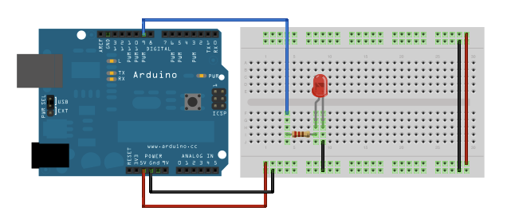

# MIT Blueprint Learnathon 2019 Arduino Track

Arduino track content from [Blueprint 2019](https://blueprint.hackmit.org/2019/).

Follow along with the slides **[here](slides.pdf)**!

## Time Block 1 (10-11am Claire, 11-11:30am Noah)

### 1.0 - Welcome & Outline (Claire)

* [Write HELPq URL on board]
* [SLIDE 1: title] Sit toward the front, two to a kit!
* ~ quiet ~
* **_What_**: Arduino track
* **_When_**: 1.5 hours
* **_Who_**: Claire & Noah
* [SLIDE 2: HELPq]
  * Please raise your hand for general questions
  * These are the mentors!
  * Sign up for Github
  * Use that to sign in at [https://q.hackmit.org](https://q.hackmit.org)

### 1.1 - Setup

* [SLIDE 3] Link to install Arduino IDE
  * [https://www.arduino.cc/en/Main/Software](https://www.arduino.cc/en/Main/Software)
* Troubleshoot issues
  * E.g. linux

### 1.2 - Overview of physical board (Noah)

* [DOC CAM] Open the box!
* *[send mentors silently in parallel to cut open all the zipties holding the wires in the kits]*
* hold the Arduino and go over it
  * Point out:
    * Microcontroller IC
    * Pins
    * USB port
    * Reset button
    * *Built-in LED (transition)*
  * _[SLIDE 15] optional board layout image_

### 1.3 - Blink onboard LED (Claire)

**Source code:** [1.3_blink/1.3_blink.ino](1.3_blink/1.3_blink.ino)

* [IDE]
  * IDE: integrated development environment
  * Partners: each of you programs individually, and then you can each upload
* `setup()`
* `loop()`
* `pinMode()`
  * Pins are the black labeled holes on the edges of the board
  * They allow the board to reference external devices
  * In this case, pin 13 *also* refers to the board’s internal LED
  * 2nd argument: each pin is explicitly output or input. We choose output here
* `digitalWrite()`
  * Digital value can either be ON or OFF (in this case, HIGH and LOW).
  * So what this means is we turn pin 13 ON.
* `delay()`
  * Pause execution of program for some number of ms
  * 1000 ms = 1 second
* Check: 5 lines
* Upload time!
  * PLUG IN
  * CHECK PORT
  * CHECK BOARD
  * CLICK UPLOAD
* Change delay & observe effect
  * ~ Observe ~

### 1.4 - Blink off-board LED (Noah)

* [SLIDE 4: breadboard]
  * Explain breadboard, wiring
  * 
  * 
* [DOC CAM] Wire up the LED
  * Gather materials
    * 1 LED (DIRECTIONAL: flat side/smaller leg is GND)
    * 1 Resistor (red, red, brown = 220 ohm)
    * 2 wires (any color!)
  * UNPLUG before wiring (makes sure you don’t damage anything)
  * Assemble materials
    * Long leg goes to resistor
    * Resistor goes to pin 13
    * Short leg goes to GND
* Change pin in code & wiring and observe effect
  * ~ observe ~

### 1.5 - Dim offboard LED (ternary blink) (Claire)

**Source code:** [1.5_fade/1.5_fade.ino](1.5_fade/1.5_fade.ino)

* [DOC CAM] Motivation: in the real world, we want more things than just ON/OFF
  * Turn it on and off really fast at different frequencies
  * We could do it ourselves, or use this handy function, **_PWM_**
  * This function only works on pins that support PWM (look for **~** in front of number)
  * CHANGE THE PIN
  * Wire the LED to **_11_**
* [IDE] `analogWrite()`
  * 255, 0, 64
* Exploratory
  * Other brightness values
  * Advanced: how could you get it to fade in and out?
  * Advanced: wire RGB LED
  * ~ observe ~
* _[SLIDE 14] optional wiring diagram_

### 1.6 - RGB LED (IF TIME) (Noah)

**Source code:** [1.6_rgb_led/1.6_rgb_led.ino](1.6_rgb_led/1.6_rgb_led.ino)

* [DOC CAM] show RGB LED
  * Basically 3 LEDs in one package: red, green, and blue
  * They share a common pin that goes to GND, so 4 total
  * Connect each one to an individual output and you can mix any color you want by using **analogWrite** on each pin
  * Show wiring - don’t unwire regular LED!
* [IDE]
  * Show example of `analogWrite` to each channel
  * Play with different values to see what colors you can create!
  * Advanced: use delays and/or variables/loops to change colors over time
* _[SLIDE 16] optional RGB LED wiring diagram_

### 1.7 - Wrap up

* [SLIDE 5] Wrap-up
  * Leave your hardware as-is
  * Remember where you sat
  * Come back here if you want

## Time Block 2 (1-2pm)

### 2.0 - Settle in (Claire)

* [SLIDE 6] Settle in
* Quick recap: **OUTPUT**
  * Board
  * Blink onboard LED
  * Blink offboard LED
  * Dim offboard LED
  * RGB LED (?)
* Now: **INPUT**
  * Button
  * Light sensor
  * Serial

### 2.1 - Button (Claire)

**Source code:** [2.1_button/2.1_button.ino](2.1_button/2.1_button.ino)

* Digital input is like digital output, but input (receive HIGH or LOW)
* [DOC CAM]
  * Gather materials
    * 1 Button (tiny)
    * 3 wires (any color)
  * Assemble
    * *Straddle the gap*
    * *Explain that pressing button makes invisible connection [here] to [here]*
    * Remove LED → GND wire
    * Add wire GND → breadboard GND row
    * Re-add wire GND row → LED
    * Add wire GND row → button
    * Add wire button → 7
  * ~ pause ~
* [IDE] New sketch (save the old one)
* `pinMode(pin, INPUT_PULLUP)`
  * INPUT
    * we want to get data
  * PULLUP
    * when button is not pressed, not connected to anything
    * would normally be undefined, random static electricity
    * PULLUP means Arduino automatically forces value to be HIGH when not pressed, LOW when pressed.
* `digitalRead()`
  * Read from pin
* Extensions
  * Make the button into a light switch (press to toggle on/off)
  * Click to control the color of your RGB LED if you got to 1.6 earlier

### 2.2 - Analog inputs, Serial plotter (Noah)

**Source code:** [2.2_photoresistor/2.2_photoresistor.ino](2.2_photoresistor/2.2_photoresistor.ino)

* We did digital input, now *analog* input
* [DOC CAM] Introduce photoresistor
  * It’s like a resistor, but the resistance changes with brightness
  * We can make a clever circuit to measure this as a change in voltage, aka an *analog signal*
  * Gather materials
    * 1 photoresistor (squiggles, direction doesn’t matter)
    * 1 resistor (1k - brown, black, red)
    * 4 wires
  * Assemble
    * 
    * 5V → breadboard power rail
    * Breadboard power rail → photoresistor leg 1
    * Photoresistor leg 2 → A0
    * Photoresistor leg 2 → Breadboard GND rail
    * _[SLIDE 17] optional voltage divider diagram_
    * [IDE] NEW FILE
      * `Serial.begin(115200)`
        * Serial = communication over USB cable
        * Communication rate
      * `analogRead()` (use variable!)
      * `Serial.println()`
      * Small delay
  * Observe the serial monitor
    * See how numbers go up and down
    * ~ check that everyone is on the same page ~
  * Observe the serial plotter
    * BIG PAYOFF!!
* Extensions:
  * Make a nightlight: turn LED on if photoresistor value < some threshold
  * Control LED brightness with photoresistor (sun bright → LED bright, or the opposite)
  * Replace photoresistor with thermistor
  * Replace photoresistor with joystick
* [SLIDE 7] Part 2 over

## Time block 3 (2-3pm)

* [SLIDE 8] Settle in

### 3.1 - Servo

* [DOC CAM] Motivation:
  * Learn how to use more complicated outputs!
  * Servo: motor module that can turn to a specific angle
  * Useful for things like *robotic arms* that require precise control
* Gather materials
  * 1 servo
  * 3 wires
* Assemble
  * WARNING: if you do this backwards you’ll break your servo :disappointed:
  * Put the hat on the servo
  * Servo BROWN to breadboard GND
  * Servo RED to breadboard high
  * Servo ORANGE to pin 6 (any ~ pin)
  * _[SLIDE 18] optional servo wiring diagram_
* [IDE] NEW FILE
  * Servos require a complicated input signal, but thankfully someone else has written code to control them for us. This is what we call a *library*.
  * Sketch → Include Library → Servo
  * For loop
    * Has anyone used a for loop before?
    * Initial condition, stop condition, iteration
    * Repeat everything inside the curly braces ("loop")
* ~ observe the moves ~

### 3.2 - Servo with joystick (Noah)

* [DOC CAM] Motivation: CONTROL OUR ROBOT ARM
* Gather parts
  * Joystick and hat
  * 3 male to female wires (wire only on one side)
* Assemble
  * Hat on joystick
  * Joystick VCC → breadboard high
  * Joystick GND → breadboard GND
  * Joystick data → pin A1
  * _[SLIDE 19] optional joystick wiring diagram_
* [IDE] same file
  * `map()`: input is 0 → 1023, but we can only write 0 → 180
* Extensions
  * Play with other joystick axis
  * Use joystick toggle button (?)
  * Joystick to control RGB LED channels
  * Combine anything you have lol

### 3.3 - LCD setup (IF TIME)

**Source code:** [3.3_helloworld/3.3_helloworld.ino](3.3_helloworld/3.3_helloworld.ino)

* [DOC CAM] Motivation: PRETTY SCREEN, learn how to DIY
* Gather parts
  * 1 LCD
  * 1 potentiometer
    * a knob that changes resistance when you turn it, for adjusting contrast
  * Many wires
  * [SLIDE 9] Just show them the image & let them go
  * _[SLIDE 20] optional alternate LCD wiring diagram_
  * Some wiring in diagram might conflict with earlier parts, so you can either take apart stuff from earlier or change the pins in the code
  * *~ Encourage them: this is how to be more on your own! Look up libraries! Good lead-in for project! Once you get Hello, World you can download Kye’s fun code for joystick ~*
  * File → Examples → LiquidCrystal → HelloWorld
  * Library documentation: straightforward, nice interface - [https://www.arduino.cc/en/Reference/LiquidCrystal](https://www.arduino.cc/en/Reference/LiquidCrystal)

### 3.4 - Extensions (we probably won’t get to this)

**Source code:** [3.4_lcd_control/3.4_lcd_control.ino](3.4_lcd_control/3.4_lcd_control.ino)

* Display joystick values to screen
* Move cursor on-screen w/ joystick
  * code for this is in github, straightforward
* [SLIDE 10] Part 3 over

## Time block 4 (3:30 PM - 4:30 PM) - Claire

* [SLIDE 11] Settle in

### 4.1 - Open-ended project (work on anything or choose guided project)

* [SLIDE 12] List some project ideas
* LCD w/ joystick if we didn’t get to it
* Guided project: reaction test game
  * Code at [reaction_game/reaction_game.ino](reaction_game/reaction_game.ino)
  * Additional add-ons: LCD display for score, buzzer for audio feedback
* [SLIDE] project ideas
  * Radar system (too complex (?))
    * coding > wiring/hardware
    * [https://www.youtube.com/watch?v=kQRYIH2HwfY](https://www.youtube.com/watch?v=kQRYIH2HwfY)
  * Temperature/humidity monitor
  * Remote control w/ servo/stepper (?)
  * Theremin w/ ultrasonic sensor + speaker
  * Microphone + LED visualizer
  * Bop-it
* [SLIDE 13] fin.

## Licenses

This curriculum and `slides.pdf` are licensed under CC BY-SA 4.0 (see [LICENSE_CURRICULUM.txt](LICENSE_CURRICULUM.txt)).

The example code under `1.3_blink/`, `1.5_fade/`, and `2.1_button` is in the public domain.

The example code under `2.2_photoresistor/`, `3.4_lcd_control/`, and `reaction_game` is under the [MIT license](reaction_game/LICENSE.txt).

The example code under `1.6_rgb_led/` and `3.3_helloworld/` is (presumably?) (c) [Elegoo Inc.](https://www.elegoo.com/).
